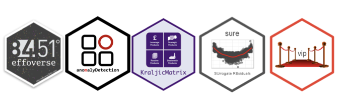

```{r setup, include=FALSE}
library(RefManageR)
BibOptions(check.entries = FALSE,
           bib.style = "authoryear",
           cite.style = "alphabetic",
           style = "markdown",
           hyperlink = FALSE,
           dashed = FALSE)
myBib <- ReadBib("./references.bib", check = FALSE)
```

class: title-slide   

<br><br><br><br><br><br><br>
.font200[An Inner Source Ecosystem]

.font140[Scaling productivity]

<br>
.font110[Bradley Boehmke<br>June 8, 2021<br>[bradleyboehmke.github.io/analytics-summit-2021/](https://bradleyboehmke.github.io/analytics-summit-2021/)]


---
class: section-slide 

<br><br><br><br><br><br><br><br><br><br><br>
# .font150[Setting expectations]

---
class: no-header-slide

<br><br>

.pull-left.font110[

]

<br>
.font140.pull-right[

* Who am I

* TBD

* TBD

]

---
class: no-header-slide

<br><br>

.pull-left.font110[

### TL;DR

* Data scientist (1) | Software engineer (2)

* TBD

* TBD

]

<br>
.opacity10.font140.pull-right[

* Who am I

* General research interests

* Interpretable machine learning

]

---
class: section-slide 

<br><br><br><br><br><br><br><br><br><br><br>
# .font150[Who am I]

---

# About me  

<br>

.pull-left[

```{r, echo=FALSE}
knitr::include_graphics("figures/name-tag.png")
```

]

.pull-right[

```{r, echo=FALSE, out.width="80%", out.height="80%"}
knitr::include_graphics("figures/fam.png")
```

]

---

# About me  

<br>

.pull-left[

```{r, echo=FALSE}
knitr::include_graphics("figures/name-tag.png")
```

]

.pull-right[

```{r map-home, echo=FALSE}
library(leaflet)

home <- tibble::tibble(
   Longitude = c(-84.015850),
   Latitude = c(39.692720)
   )

leaflet() %>% 
  addTiles() %>%
  setView(lat = 39.692720, lng = -84.015850, zoom=5) %>%
  addMarkers(lng=-84.015850, lat=39.692720)
```

]

---

# About me  

<br>

.pull-left[

```{r, echo=FALSE}
knitr::include_graphics("figures/name-tag.png")
```

]

.pull-right[

Air Force &ensp; &ensp; &#8729; &#8729; &#8729; &#8729; &#8729; &#8729; &#8729; &#8729; &#8729; &#8729; &#8729; &#8729; &#62; Finance Officer

Booz Allen Hamilton &ensp; &#8729; &#8729; &#8729; &#62; Cost Analyst

Air Force A9 &ensp; &#8729; &#8729; &#8729; &#8729; &#8729; &#8729; &#8729; &#8729; &#8729; &#8729; &#8729; &#62; OR Analyst

AFIT &ensp; &#8729; &#8729; &#8729; &#8729; &#8729; &#8729; &#8729; &#8729; &#8729; &#8729; &#8729; &#8729; &#8729; &#8729; &#8729; &#8729; &#8729; &#8729; &#62; Professor

University of Cincinnati &ensp; &#8729; &#62; Adjunct

Ascend Innovations  &ensp; &#8729; &#8729; &#8729; &#8729; &#62; Data Scientist

84.51° &ensp; &#8729; &#8729; &#8729; &#8729; &#8729; &#8729; &#8729; &#8729; &#8729; &#8729; &#8729; &#8729; &#8729; &#8729; &#8729; &#8729; &#62; Director, Data Science

]

---

# About me  

<br>

.pull-left[

```{r, echo=FALSE}
knitr::include_graphics("figures/name-tag.png")
```

]


.pull-right.scrollable90[

* Intro to `r fontawesome::fa("r-project")` [`r fontawesome::fa("link", height = 15, fill = 'lightgrey')`](https://github.com/uc-r/Intro-R)
* Intro to `r fontawesome::fa("python")` [`r fontawesome::fa("link", height = 15, fill = 'lightgrey')`](https://github.com/uc-python/intro-python-datasci)
* Intermediate `r fontawesome::fa("r-project")` [`r fontawesome::fa("link", height = 15, fill = 'lightgrey')`](https://github.com/uc-r/Intermediate-R)
* Intermediate `r fontawesome::fa("python")` [`r fontawesome::fa("link", height = 15, fill = 'lightgrey')`](https://github.com/uc-python/intermediate-python-datasci)
* Data Wrangling with `r fontawesome::fa("r-project")` [`r fontawesome::fa("link", height = 15, fill = 'lightgrey')`](http://uc-r.github.io/data_wrangling)
* Machine Learning with `r fontawesome::fa("r-project")` [`r fontawesome::fa("link", height = 15, fill = 'lightgrey')`](https://github.com/uc-r/Advanced-R)
* Advanced `r fontawesome::fa("python")` [`r fontawesome::fa("link", height = 15, fill = 'lightgrey')`](https://github.com/uc-python/advanced-python-datasci)
* Deep Learning with Keras and TensorFlow [`r fontawesome::fa("link", height = 15, fill = 'lightgrey')`](https://github.com/rstudio-conf-2020/dl-keras-tf)
* Delivering Data Science Products via Packages [`r fontawesome::fa("link", height = 15, fill = 'lightgrey')`](https://github.com/misk-data-science/misk-packages)
* Text Mining with `r fontawesome::fa("r-project")` [`r fontawesome::fa("link", height = 15, fill = 'lightgrey')`](https://github.com/bradleyboehmke/R-Training-Text-Mining)
* Interpretable Machine Learning [`r fontawesome::fa("link", height = 15, fill = 'lightgrey')`](https://github.com/bradleyboehmke/CinDay-RUG-IML-2018)
* DevOps for Data Science (internal)


]

---

# About me  

<br>

.pull-left[

```{r, echo=FALSE}
knitr::include_graphics("figures/name-tag.png")
```

]

.pull-right[

```{r, echo=FALSE, out.width="49%", out.height="20%", fig.show='hold'}
knitr::include_graphics(c("https://images-na.ssl-images-amazon.com/images/I/41ttvv4UJ%2BL._SX331_BO1,204,203,200_.jpghttps://images.tandf.co.uk/common/jackets/amazon/978113849/9781138495685.jpg", "https://images.tandf.co.uk/common/jackets/amazon/978113849/9781138495685.jpg"))
```

```{r, eval=FALSE, echo=FALSE, out.height=400}
knitr::include_graphics("https://images.tandf.co.uk/common/jackets/amazon/978113849/9781138495685.jpg")
```

]


---
# About me  

<br>

.pull-left[

```{r, echo=FALSE}
knitr::include_graphics("figures/name-tag.png")
```

]

.pull-right[

<br><br>

```{r, echo=FALSE}

```

]

---

# About me  

<br>

.pull-left[

```{r echo=FALSE}
knitr::include_graphics("figures/name-tag.png")
```

]


.font120.pull-right[
<br><br>
[`r fontawesome::fa("globe", fill = "steelblue")`](http://bradleyboehmke.github.io/) bradleyboehmke.github.io  <br>
[`r fontawesome::fa("github", fill = "steelblue")`](https://github.com/bradleyboehmke/) @bradleyboehmke  <br>
[`r fontawesome::fa("twitter", fill = "steelblue")`](https://twitter.com/bradleyboehmke) @bradleyboehmke  <br>
[`r anicon::aia("google-scholar", color = "steelblue", animate = FALSE)`](http://bit.ly/bradleyboehmke_scholar) bit.ly/bradleyboehmke_scholar <br>
[`r fontawesome::fa("envelope", fill = "steelblue")`](mailto:bradleyboehmke@gmail.com) bradleyboehmke@gmail.com  

]


---
class: section-slide 

<br><br><br><br><br><br><br><br><br><br><br>
# .font150[What is inner source?]

---
# Topics

- What is open source
- Show example of R/Python open source pkgs
- Discuss why open source is so successful
- Contrast this with the idea of inner source

---
# Well, first, what is open source?

.pull-left.center[

```{r, echo=FALSE, out.width='80%'}
knitr::include_graphics("figures/r-open-source.png")
```

]

.pull-right.center[

<br><br>

```{r, echo=FALSE, out.width='80%'}

```

]

---
# Well, first, what is open source?

<br>
Yes, open source means free access to use code.

<br><br>

--

But more importantly, the open source model is...

> _"a decentralized software development model that encourages open collaboration, meaning any system of innovation or production that relies on goal-oriented yet loosely coordinated participants who interact to create a product (or service) of economic value."_  - `r Citet(myBib, author = "Levine")`

---


---
class: section-slide 

<br><br><br><br><br><br><br><br><br><br><br>
# .font150[Establishing inner source at 84.51°]

---
# Topics

- Talk about size of 84.51 and why inner source is relevant
- Driving force of inner source need --> migration and lack of consistency
- Talk about APTS team formation
- Initial packages
- R ~vs~ and Python

---
class: section-slide 

<br><br><br><br><br><br><br><br><br><br><br>
# .font150[Nurturing inner source at 84.51°]

---
# Topics

- A growing ecosystem
- Standardization
- Certification
- cookiecutter

---
class: section-slide 

<br><br><br><br><br><br><br><br><br><br><br>
# .font150[Main takeaways]

---
class: section-slide 

<br><br><br><br><br><br><br><br><br><br><br>
# .font150[Thank You!]

---

# References

```{r refs, echo=FALSE, results="asis"}
PrintBibliography(myBib)
```
