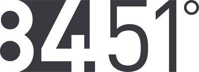

```{r setup, include=FALSE}
library(RefManageR)
BibOptions(check.entries = FALSE,
           bib.style = "authoryear",
           cite.style = "alphabetic",
           style = "markdown",
           hyperlink = FALSE,
           dashed = FALSE)
myBib <- ReadBib("./references.bib", check = FALSE)
```

class: title-slide   

<br><br><br><br><br><br><br>
.font200[An Inner Source Ecosystem]

.font140[Scaling productivity at 84.51°]

<br>
.font110[Bradley Boehmke<br>June 8, 2021<br>[bit.ly/inner_source](http://bit.ly/inner_source)]

---
class: section-slide 

<br><br><br><br><br><br><br><br><br><br><br>
# .font150[Who is 84.51°]

---

# Kroger's little brother

.pull-left[
<br><br><br><br><br>
```{r, echo=FALSE, fig.align='center', out.width="80%"}

```


]

.pull-right[
<br><br>
```{r, echo=FALSE, fig.align='center', out.width="80%"}

```
]

---

# Company Profile

```{r, echo=FALSE, fig.align='center', out.width="100%"}

```

---

# Growing pains

.pull-left[

- Stove pipe processes

- Code duplication 

- Code inconsistencies

]

.pull-right[

```{r, echo=FALSE, fig.align='center', out.height=500}
knitr::include_graphics("https://images.unsplash.com/photo-1616801877957-0d5ac4b50531?ixid=MnwxMjA3fDB8MHxwaG90by1wYWdlfHx8fGVufDB8fHx8&ixlib=rb-1.2.1&auto=format&fit=crop&w=701&q=80")
```

]

---

# Growing pains

.pull-left[

- Platform migrations

- Nuance, non-relevant detail changes

- Code re-work

]

.pull-right[

```{r, echo=FALSE, fig.align='center', out.height=500}
knitr::include_graphics("https://images.unsplash.com/photo-1525109556882-cb01f87f4552?ixid=MnwxMjA3fDB8MHxwaG90by1wYWdlfHx8fGVufDB8fHx8&ixlib=rb-1.2.1&auto=format&fit=crop&w=634&q=80")
```


]

---

class: section-slide, middle

<br><br><br><br><br><br>
# Can we rethink how we build & deliver <br>internal tools?

---
class: no-header-slide, center, middle

.font250[Taking a page from the <br>open-source world]

---
class: no-header-slide, center, middle

.pull-left[

`r fontawesome::fa("python", height = 250)`

]

.pull-right[

`r fontawesome::fa("r-project", height = 250)`

]

---
class: no-header-slide, center, middle

.pull-left.center[

<br><br>

```{r, echo=FALSE, out.width='80%'}
knitr::include_graphics("figures/py-open-source.jpg")
```

]

.pull-right.center[

```{r, echo=FALSE, out.width='80%'}

```

]

---
# Inner source

<br><br><br><br>

> _.font150[Taking the lessons learned from developing open source software and applying them to the way we develop software internally.]_

---

# Not new

<br><br><br>

```{r, echo=FALSE, fig.align='center'}
knitr::include_graphics("https://innersourcecommons.org/images/logo.png")
```

.font120.center[https://innersourcecommons.org/]

---

# Not new

```{r, echo=FALSE}
knitr::include_graphics("https://innersourcecommons.org/images/learn/innersourceinaction.png")
```

---

# Value proposition

<br>

* .font130.bold[.blue[Open collaboration] --> .green[Faster innovation]]

---

# Value proposition

<br>

* .opacity[Open collaboration --> Faster innovation]

* .font120.bold[.blue[Code reduction] --> .green[Less tech debt]]

---

# Value proposition

<br>

* .opacity[Open collaboration --> Faster innovation]

* .opacity[Code reduction --> Less tech debt]

* .font120.bold[.blue[Code consistency] --> .green[Better governance]]

---

# Value proposition

<br>

* .opacity[Open collaboration --> Faster innovation]

* .opacity[Code reduction --> Less tech debt]

* .opacity[Code consistency --> Better governance]

* .font120.bold[.blue[Simple & common interfaces] --> .green[Faster delivery]]


---

# Value proposition

<br>

* .opacity[Open collaboration --> Faster innovation]

* .opacity[Code reduction --> Less tech debt]

* .opacity[Code consistency --> Better governance]

* .opacity[Simple & common interfaces --> Faster delivery]

* .font120.bold[.blue[Baked in best practices] --> .green[Resource efficiency]]

---

# Value proposition

<br>

* .opacity[Open collaboration --> Faster innovation]

* .opacity[Code reduction --> Less tech debt]

* .opacity[Code consistency --> Better governance]

* .opacity[Simple & common interfaces --> Faster delivery]

* .opacity[Baked in best practices --> Resource efficiency]

* .font120.bold[.blue[Modular] --> .green[Establish 'lego' building blocks]]

---
class: section-slide 

<br><br><br><br><br><br><br><br><br><br><br>
# .font150[Establishing inner source at 84.51°]

---
# Create momentum

.pull-left[

- .font130.bold[.blue[Strong core team] --> .green[Clear direction]]

]

.pull-right[

```{r, echo=FALSE, out.width='70%', fig.align='center'}

```

]

---
# Promote collaboration

.pull-left[

- .opacity[Strong core team --> Clear direction]

- .font120.bold[.blue[Right tools] --> .green[Align to OSS WoW]]

]

.pull-right[

```{r, echo=FALSE, out.width='100%'}

```

]

???

- Providing the right tools is important
   - aligning to OSS WoW
   - new folks adapt quicker
- Education on how to use tools is also critical
   - Github is still foreign to many
   
---
# Promote collaboration

.pull-left[

- .opacity[Strong core team --> Clear direction]

- .font120.bold[.blue[Right tools] --> .green[Align to OSS WoW]]

]

.pull-right[

```{r, echo=FALSE, out.width='100%'}

```

]

???

- Providing the right tools is important
   - aligning to OSS WoW
   - new folks adapt quicker
- Education on how to use tools is also critical
   - Github is still foreign to many

---
# Over communicate

- .opacity[Strong core team --> Clear direction]

- .opacity[Right tools --> Align to OSS WoW]

- .font120.bold[.blue[Clear & consistent communication] --> .green[Broader knowledge transfer]]

   - Open roadmap
   
   - Pushing Q&A to Github & SO for persistance
   
   - Release notes

   - User docs

   - Newsletter

   - Office hours


---

# Embracing DevOps

.pull-left[

- .opacity[Strong core team --> Clear direction]

- .opacity[Right tools --> Align to OSS WoW]

- .opacity[Communications --> Knowledge transfer]

- .bold[.blue[Simple & reliable architecture] --> .green[Production worthy]]


]

.pull-right[

<br><br><br>

```{r, echo=FALSE, out.width='100%'}

```

]

---

# Consistency is your friend

.pull-left[

- .opacity[Strong core team --> Clear direction]

- .opacity[Right tools --> Align to OSS WoW]

- .opacity[Communications --> Knowledge transfer]

- .opacity[Simple & reliable architecture --> Production worthy]

- .bold[.blue[Fight for consistency] --> .green[Users will thank you!]]

]

---

# Resulting ecosystem

```{r, echo=FALSE, out.width='100%'}

```

???

Show packages in hex style

- XX total packages we are aware of

- of which we manage 14

---

# Legos for data science

.pull-left[

.bold[How might one leverage these tools?]

A data scientist needs to provide KPI metrics for all UPCs that fall in a particular sub commodity (i.e. Coca Cola products) sold at preferred stores (Kroger Marketplace stores) during the last fiscal quarter.

]

--

.pull-right[

```{r, echo=FALSE, out.width='100%'}

```

]


???

Show how DSRs can piece togeher packages to analyze a problem

---

# Growth in adoption

<br><br><br>

.pull-left.center[

.font300.green[ \> 25,000] 

function calls per month

]

.pull-right.center[

.font300.green[ \> 100] 

distinct users per month

]

---
class: section-slide 

<br><br><br><br><br><br><br><br><br><br><br>
# .font150[Nurturing inner source at 84.51°]

---

# Increased focus on .red[collaboration]

.pull-left[

Growth in package development is now growing more outside the core team than inside requiring the core team to focus more on...

* Helping teams to scope & plan

* Q&A / Paired programming

* Code reviews

* Collaborative partnerships

]

.pull-right[

```{r, echo=FALSE}

```

]

---

# Increased focus on .red[contributors]

.pull-left[

Working on increasing the number of core contributors across the company

- increases package maturity & evolution

- decreases maintenance bottlenecks

]

.pull-right[

```{r, echo=FALSE}

```

]

---

# Increased focus on .red[governance]

.pull-left[

Governance acts as an informer and not a gatekeeper

* `r emo::ji("check")` .bold.green[Trusted Core]

* `r emo::ji("check")` .bold.green[Trusted Certified]

* `r emo::ji("prohibited")` .bold.red[Known Untrusted]

* `r emo::ji("warning")` .bold.red[Uncertified]

]

.pull-right[

```{r, echo=FALSE}
knitr::include_graphics("https://pnwe.org/wp-content/uploads/2020/05/21/Certification.jpg")
```

]

---

# Increase focus on .red[developer capabilities]

.pull-left.font120[

<br>

* Tool development upskilling

* Tool development tooling

]

.pull-right[

```{r, echo=FALSE}

```

]

---

# Challenges & opportunities

<br>

.font140[

* Multi-language support is hard

* Multi-functional support is hard

* Moving from a "my team" to "our community" perspective

* Moving from an "ownership" to a "stewardship" model

* Metrics are hard

]

---
class: section-slide 

<br><br><br><br><br><br><br><br><br><br><br>
# .font150[So what?]

---

# Take aways

.pull-left[

Inner source can provide your organization many benefits:

* Faster innovation

* Less tech debt

* Better governance

* Faster delivery

* Resource efficiency

* 'Lego' building blocks

]

--

.pull-right[

But its not easy and consider it a journey not a race:

* Requires buy-in from leadership

* You need to create momentum

* Requires a mix of software engineering and data science skills

* Requires the right infrastructure

* Measuring success is not easy

]

---
background-image: url(figures/get-started.jpeg)
background-position: center
background-size: contain
class: no-header-slide

---
class: section-slide 

<br><br><br><br><br><br><br><br><br><br><br>
# .font150[Thank You!] <br>.font90[http://bit.ly/inner_source]

---

# Keep in touch!  

<br>

.pull-left[

```{r echo=FALSE}
knitr::include_graphics("figures/name-tag.png")
```

]


.font120.pull-right[
<br><br>
[`r fontawesome::fa("globe", fill = "steelblue")`](http://bradleyboehmke.github.io/) bradleyboehmke.github.io  <br>
[`r fontawesome::fa("github", fill = "steelblue")`](https://github.com/bradleyboehmke/) @bradleyboehmke  <br>
[`r fontawesome::fa("twitter", fill = "steelblue")`](https://twitter.com/bradleyboehmke) @bradleyboehmke  <br>
[`r anicon::aia("google-scholar", color = "steelblue", animate = FALSE)`](http://bit.ly/bradleyboehmke_scholar) bit.ly/bradleyboehmke_scholar <br>
[`r fontawesome::fa("envelope", fill = "steelblue")`](mailto:bradleyboehmke@gmail.com) bradleyboehmke@gmail.com  

]

---

# References

```{r refs, echo=FALSE, results="asis"}
PrintBibliography(myBib)
```
